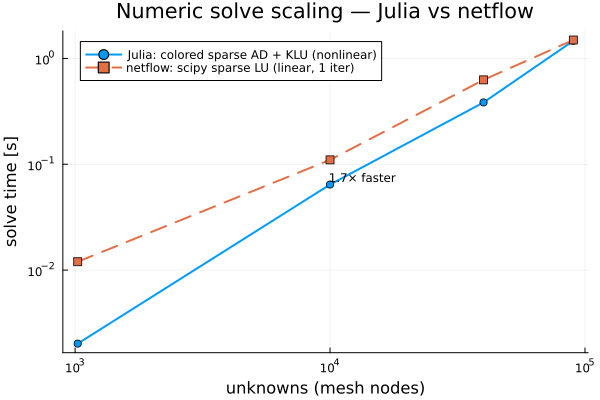
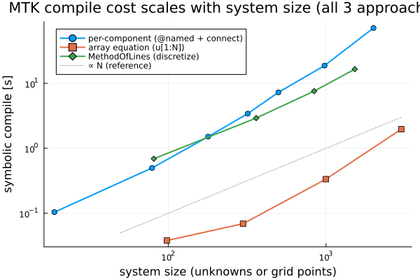

# A Modelica user's first experience with ModelingToolkit — notes for the SciML team

**What this is:** a TRANSFORM/Modelica user (nuclear thermal-hydraulics) rebuilt a
small reactor thermal model in MTK v11.26.5 and benchmarked it against a hand-rolled
Python solver. Everything below is **reproducible** (scripts named inline) and
measured on one WSL2 box: Julia 1.11.9, MTK v11.26.5, MTKStandardLibrary v2.28.0,
NonlinearSolve v4.19.1, MethodOfLines v0.11.x.

## TL;DR

- **The good:** acausal + signal composition, stream connectors, and the numerics
  are excellent. With a sparse colored-AD + KLU setup, MTK **matched/beat** the
  hand-rolled sparse solver (1.7× faster at 10k unknowns, parity at 90k).
- **The wall:** building real models the obvious way (per-component `@named` +
  `connect()`) generates **unrolled** code; `mtkcompile` + JIT dominate and scale
  super-linearly. A 25-pin assembly compiles in ~7 s; a full 17×17×30 would be
  ~25–40 min — *to compile, not solve.*
- **We checked the obvious rebuttals:** array-symbolic equations **scalarize**
  (unknowns = N, not O(1)); **MethodOfLines has the same wall** (it scalarizes per
  grid point). The one documented escape, **JuliaSimCompiler (IRSystem)**, isn't in
  the General registry.
- **Net:** the numerics are there; the gap is *fast codegen for large structured
  models* — which we understand is on the roadmap (array equations + Reactant).

## What worked well (please don't lose these)

- **Cross-domain composition is real.** A custom point-kinetics block (`RealInput`
  fuel-T → `RealOutput` power) + Doppler feedback wired to the thermal acausal domain
  (HeatPort) via `Blocks` solved the coupled feedback loop to the analytic
  equilibrium exactly. Friction-free. (`test/slice7_neutronics_feedback.jl`)
- **Stream connectors** (`m_flow` Flow + `h_outflow` Stream, `instream`) gave exact
  energy conservation for 1-D enthalpy advection. (`test/slice2,3`)
- **Numerics scale well** with the right setup — see below.
- **Robust default solver** escaped a friction nonlinearity (Δp = K·ṁ|ṁ|) from a
  zero-flow start where bare `NewtonRaphson` got trapped at the singular Jacobian.

*Nonlinear 2-D mesh, colored sparse AD + KLU vs scipy sparse LU. Julia's solve is
nonlinear (multi-Newton); the reference is linear (1 iter), so this is conservative
for Julia. (`bench/scaling_native.jl`)*

**Methods note (to pre-empt the standard rebuttal):** the Jacobian is **autodiff**
(`TracerSparsityDetector` → `GreedyColoring` → `jac_prototype`/`colorvec` +
`KLUFactorization`), not a symbolic Jacobian. This matches the current SciML guidance
that symbolic Jacobians are typically the wrong tool at scale — see Rackauckas on
[unpredictable MTK compilation perf, Apr 2026](https://discourse.julialang.org/t/unpredictable-compilation-performance-of-mtk-generated-functions/136827).
So the compile costs reported below are *not* a symbolic-Jacobian artifact.

## The main issue — compile cost, not solve cost

The numeric solve is cheap and scales; the cost is **symbolic compile + JIT of
unrolled generated code**, and it spans every approach we tried:

*All three are above the ∝N reference. `bench/scaling_assembly.jl`,
`repro_array_scalarize.jl`, `scaling_mol.jl`. (Array-equations are lowest-overhead
but still scalarized — unknowns = N — and not a usable pattern for component models;
MethodOfLines additionally pays a large first-solve JIT, ~46 s at 1521 points.)*

- **Per-component** (`@named` + `connect()` × N): `mtkcompile` ~N^1.6 on a realistic
  coupled assembly — 7 s @ 499 unknowns, 71 s @ 2000.
- **Array equations** (`@variables u(t)[1:N]`, one broadcast array equation):
  `interior ~ zeros(N-2)` compiles to **N scalar equations** (unknowns = N). Not the
  O(1) looped codegen one hopes for. (We know this is the roadmap direction — array
  equations + Reactant — flagging that it bites today.)
- **MethodOfLines** (the recommended PDE tool): same scalarization wall — 2-D heat
  discretize+1st-solve 1.8 s @ 81 pts → 62 s @ 1521 pts (~N^1.3). Consistent with
  the documented limitation and with ctessum's recent
  [vibe-coded MTK PDE codegen thread (Apr 2026)](https://discourse.julialang.org/t/vibe-coded-modelingtoolkit-code-generation-for-pdes/136701),
  which states explicitly that current released MTK + MOL doesn't work above
  `vars × grid ≈ 1000` — exactly the regime where we hit it.
- **JuliaSimCompiler (IRSystem)** is the documented escape, but it isn't in the
  General registry — it needs the JuliaHub registry/license — so we couldn't test it.
  When it *has* been used, the speedup is real:
  [njacki + Rackauckas, Jul 2025](https://discourse.julialang.org/t/modeling-toolkit-mtkcompile-taking-forever-for-large-systems/130646)
  report 4400 equations going from ~3 h to ~10 s. We understand from
  [Rackauckas, Apr 2026](https://discourse.julialang.org/t/unpredictable-compilation-performance-of-mtk-generated-functions/136827)
  that JuliaSimCompiler is now unmaintained and being superseded by **DyadCompiler**
  (also a JuliaHub product). So the escape exists, but it's registry-gated and the
  successor is also commercial — which is worth knowing for open-source users.

## UX friction (papercuts a new user actually hits)

- **The fast path isn't the default or discoverable.** `NonlinearProblem(sys;
  sparse=true)` builds a *symbolic* sparse Jacobian (slow) and does **not** auto-use
  coloring or a sparse linear solver; we only got the good numbers after manually
  adding `jac_prototype` + `colorvec` + `KLUFactorization()`. NonlinearSolve v4 also
  removed `autodiff=AutoSparse(...)` (the error message does point the right way).
- **Misleading retcodes:** a *converged* large-magnitude solve reported
  `retcode=MaxIters`/`Stalled` (residual fine; tolerance vs variable scale). Easy to
  misread as failure.
- **Cryptic init error:** transient DAE init throws an opaque error until you
  separately `using OrdinaryDiffEqNonlinearSolve`.
- **`G=0` `ThermalConductor` → `Unstable`.** A degenerate zero-conductance element
  (natural when parametrizing coupling on/off) silently breaks the solve; omit the
  element instead.
- Minor: `@mtkmodel` didn't resolve in `Main` (SciCompDSL sublib); `HeatCapacitor`
  uses `T`, not `T_start`.

## Reproducers

`bench/scaling_native.jl` (numerics vs reference), `bench/scaling_assembly.jl`
(per-component wall), `bench/repro_array_scalarize.jl` (array scalarization),
`bench/scaling_mol.jl` (MethodOfLines wall), `bench/diag_colored.jl` (the fast
sparse path). Model components in `src/ThermalChain.jl`; physics verification in
`test/slice*.jl`.

## The one question for you

Is there a *currently-shipping, open* path to fast compile for large structured
models (10⁴–10⁵ unknowns) — or is JuliaSimCompiler the only one today? If the latter,
that's the single biggest thing standing between MTK and the Modelica/Dymola crowd
for plant-scale models. Happy to test an IRSystem/Reactant path if pointed at one.
