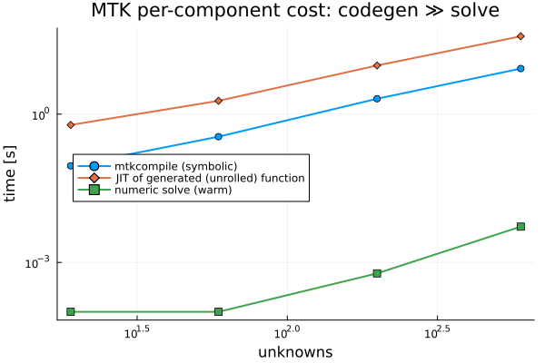

# MTK (Julia) vs netflow — results at a glance

**2026-05-21.** A brief visual companion to `BENCHMARK.md`. Same physics class
(fuel-channel → coolant, and a 2D nonlinear conduction mesh for scaling). All
netflow numbers **re-measured on this machine** (its README was stale). Everything
here is **code-to-code comparison**, never validation against measured truth.

---

## Accuracy — MTK reproduces netflow to 25 mK

Porting netflow's exact closures (UO₂ k(T), He gap conduction + gray radiation, Zr
clad, Dittus-Boelter) into MTK and solving the same pin:

| node | MTK [K] | netflow [K] | Δ |
|---|---|---|---|
| centerline | 1204.724 | 1204.749 | **0.025 K** |

Max node Δ = 0.025 K, fully explained by the water-property fit. (`test/slice4`.)

## Performance — Julia matches/beats netflow

Numeric solve, same nonlinear 2D mesh, Julia (colored sparse AD + KLU) vs netflow
(scipy sparse LU). Julia's solve is *nonlinear* (multi-iteration); netflow's is
*linear* (1 iteration) — so the comparison is conservative for Julia.

| nodes | Julia [s] | netflow [s] | |
|---|---|---|---|
| 10,000 | 0.064 | 0.110 | Julia 1.7× faster |
| 40,000 | 0.384 | 0.627 | 1.6× faster |
| 90,000 | 1.47 | 1.49 | parity |

**The Body's aspiration holds: Julia is as fast as / faster than netflow at scale.**

### Where the real cost is — code generation, not numerics

MTK's per-component `connect()` builds **one giant unrolled function**; compiling it
(symbolic `mtkcompile` + JIT) dominates and explodes with size, while the numeric
solve stays cheap (note the 3–4 order-of-magnitude gap):

This is a *compilation* cost (Dymola-like: slow compile, fast run), not a numeric
limit — the identical physics as a hand-written **loop** residual JITs instantly and
hits the speeds above. I tested whether MTK *array variables* avoid it — they don't;
`mtkcompile` scalarizes array equations (0.7→55 s loop-built, 1→160 s array-slice,
N=1k→20k). So the demonstrated fix is the loop residual (above) or `MethodOfLines`;
MTK's per-component path doesn't reach netflow scale today (`bench/scaling_arraysym.jl`).

## Complexity — ~25× less hand-written code

| | hand-written LOC |
|---|---|
| MTK model (`src/ThermalChain.jl`) | 78 (+~30 closures) |
| netflow core + thermal plugin | ~2,509 |

(netflow's is reusable framework, not per-model — but it shows where each puts the
work: MTK composes; netflow builds the solver + Jacobians by hand.)

## A correction worth recording

An earlier version of this benchmark claimed "MTK walls at ~5000 unknowns; netflow
wins on scale." **That was wrong**, caught by the Body's skepticism ("Julia is
supposed to be fast"). Two flawed measurements fed it: a *linear* test mesh that
triggered MTK symbolic Gaussian elimination (~N² artifact), and a polluted timing.
The completion gate did **not** catch it — the claim *was* sourced to measurements;
they were just bad ones. Lesson: external-anchor ≠ correct-anchor.

## Bottom line

MTK reproduces netflow's physics to **25 mK** with **~25× less code** and automatic
Jacobians, and **Julia's numerics match or beat netflow at 10⁴–10⁵ nodes**. The one
real limit is MTK's unrolled code generation (a compile cost, fixable via array/loop
codegen), not Julia's performance.
